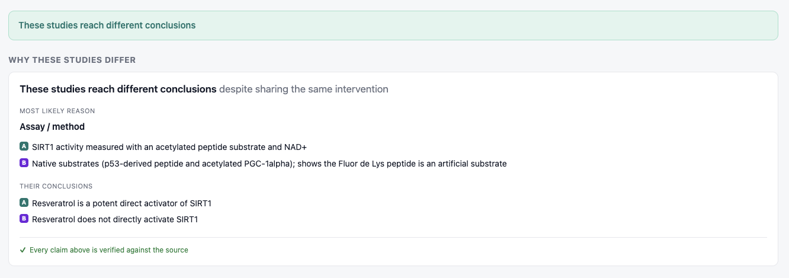
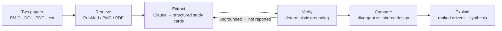

<h1 align="center">StudyDiff</h1>

<p align="center">
  <b>Understand why two scientific studies reach different conclusions —<br/>with every claim verified against the source.</b>
</p>

<p align="center">
  <a href="https://github.com/nickjlamb/studydiff/actions/workflows/ci.yml"></a>
  <a href="LICENSE"></a>
  
  <a href="https://studydiff.pharmatools.ai"></a>
  
  
  
</p>

<p align="center">
  <a href="https://studydiff.pharmatools.ai"><b>Live demo</b></a> ·
  <a href="#quick-start">Quick start</a> ·
  <a href="#how-it-works">How it works</a> ·
  <a href="#examples">Examples</a> ·
  <a href="ROADMAP.md">Roadmap</a> ·
  <a href="CONTRIBUTING.md">Contributing</a>
</p>

<p align="center">
  <a href="https://studydiff.pharmatools.ai"></a>
</p>

---

Two well-run papers often reach opposite conclusions. Usually the reason isn't that one is wrong — it's a methodological difference (a cell type, a dose, a follow-up window, an analysis choice) that a reader has to dig out of the methods sections by hand. **StudyDiff does that digging.** Give it two studies and it extracts each one's design, pinpoints the differences that most plausibly explain the disagreement, and — critically — grounds every statement in the source text, so it never invents a finding.

It is built for a bench scientist deciding which of two conflicting papers to trust before planning an experiment.

## Why it's different

Most "AI literature" tools generate a fluent answer and ask you to trust it. StudyDiff inverts that:

- **It leads with the answer, then proves it.** A plain-language explanation up top; the evidence table underneath.
- **It refuses to guess.** Any field the source doesn't state is shown as *not reported*, never inferred.
- **It verifies itself.** A deterministic grounding check (no second LLM acting as judge) confirms every extracted value and every explanation is backed by a verbatim quote and traceable numbers. Anything that fails is downgraded *before* it can be used as a reason.

## Quick start

Under 60 seconds, no API key, no network:

```bash
git clone https://github.com/nickjlamb/studydiff && cd studydiff
npm install
npm run demo                        # explains a real, famous contradiction
npm run demo -- resveratrol-sirt1   # a second worked example
```

Run the web app:

```bash
cp .env.example .env    # add ANTHROPIC_API_KEY for live comparisons
npm run serve           # http://localhost:4173
```

The built-in examples run on cached data and need no key. To compare live, add your key and use the **PMID / DOI**, **Upload PDF**, or **Paste** inputs.

## How it works



1. **Retrieve** — a PubMed/PMC client with a full-text-to-abstract fallback that tags how deep it read (`fulltext` / `abstract` / `pasted`); uploaded PDFs are text-extracted server-side.
2. **Extract** — Claude turns each paper into a fixed **study card** (species, model, assay, dose, timing, endpoint, sample size, statistic, finding, limitations). Every field carries a verbatim supporting quote; absent fields default to *not reported*.
3. **Verify** — grounding runs **first**: any value whose quote isn't in the source, or whose numbers don't trace, is downgraded to *not reported*. StudyDiff can't cite a fact it hasn't verified.
4. **Compare** — deterministic: which dimensions agree, which diverge, and the divergent *design* dimensions ranked as candidate drivers.
5. **Explain** — an answer-first synthesis naming the most likely reason, with the shared dimensions explicitly *ruled out*.

The key layer is the API key never leaving the server, and grounding being deterministic — the same inputs always produce the same verdict.

## Why Claude?

StudyDiff's reliability comes from *how* it uses Claude, not just that it does:

- **Structured extraction via tool-use.** Each paper becomes a study card through a forced Claude (Sonnet) tool schema, so every field returns validated and carries a *verbatim supporting quote* — no free-text parsing, no "mostly-JSON" failures.
- **Reasoning that maps claims to evidence.** Claude reads the methods/abstract prose and identifies both the design value and the exact sentence that supports it — the hard part of turning unstructured papers into comparable, auditable cards.
- **Claude proposes, grounding disposes.** StudyDiff never uses an LLM as the judge. A deterministic check verifies Claude's output against the source and downgrades anything unsupported *before* it's shown. Pairing Claude's tool-use extraction with non-LLM verification is what lets the tool trust its own output and sidesteps the usual LLM-as-evaluator pitfalls.
- **Built with Claude Code.** The whole app — pipeline, UI, hardening, deploy — was built iteratively with Claude Code in a single agentic loop.

## Examples

| Question | Papers | What StudyDiff finds |
|---|---|---|
| Do mouse models mimic human inflammation? | [Seok 2013](https://pubmed.ncbi.nlm.nih.gov/23401516/) vs [Takao & Miyakawa 2015](https://pubmed.ncbi.nlm.nih.gov/25092317/) | Same datasets, opposite conclusions — driven by the **gene-selection strategy**. |
| Does resveratrol activate SIRT1? | [Howitz 2003](https://pubmed.ncbi.nlm.nih.gov/12939617/) vs [Beher 2009](https://pubmed.ncbi.nlm.nih.gov/19843076/) | An **assay artifact** — the Fluor de Lys peptide substrate vs. native substrates. |

Both ship as offline demos (`npm run demo` / `npm run demo -- resveratrol-sirt1`).

## Using it

- **Web app** (`npm run serve`) — examples, PMID/DOI lookup, PDF upload, or paste; streams each pipeline step live, and exports a reproducible **Markdown report** with every value's verbatim supporting sentence.
- **CLI** — `node src/cli.mjs --q "Does resveratrol activate SIRT1?" 12939617 19843076`
- **Deploy** — see [DEPLOY.md](DEPLOY.md) (Railway + custom domain).

## Project layout

```
src/ncbi.mjs        PubMed / PMC retrieval (+ DOI resolution, source-depth tagging)
src/pdf.mjs         PDF text extraction (pure JS)
src/extract.mjs     Claude tool-use → structured study cards
src/grounding.mjs   deterministic verification (OpenGATE)
src/compare.mjs     divergence detection + driver ranking
src/gaps.mjs        bounded "observed across these papers"
src/pipeline.mjs    orchestration: retrieve → extract → verify → compare
src/server.mjs      web server + streaming API (+ rate limiting, caching)
public/index.html   single-file dashboard UI
fixtures/           cached real papers for the offline demos
```

## Roadmap

Keyword search with a results picker, a source viewer that highlights each grounded quote in the original text, batch comparison, and an exportable report. Full list in [ROADMAP.md](ROADMAP.md).

## Contributing

Contributions are welcome — see [CONTRIBUTING.md](CONTRIBUTING.md) for the setup and the invariants that keep the trust guarantee intact.

## Provenance

StudyDiff was built for Anthropic's [Built with Claude: Life Sciences](https://cerebralvalley.ai/e/built-with-claude-life-sciences) hackathon (Builder track). All application code in this repository was written from scratch during the event. Grounding uses [OpenGATE](https://github.com/nickjlamb/opengate) and PDF extraction uses `unpdf`, both as published dependencies. Retrieval uses public NCBI E-utilities; extraction uses the Claude API.

## License

[MIT](LICENSE) © Nick Lamb
